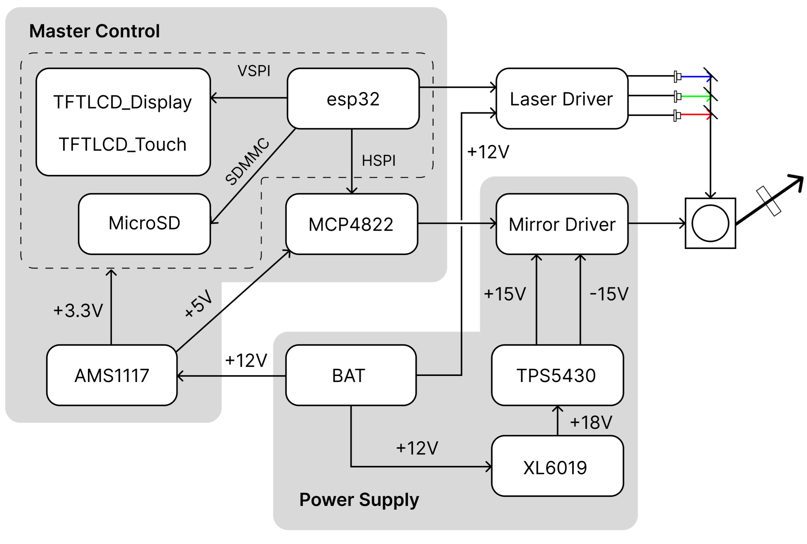
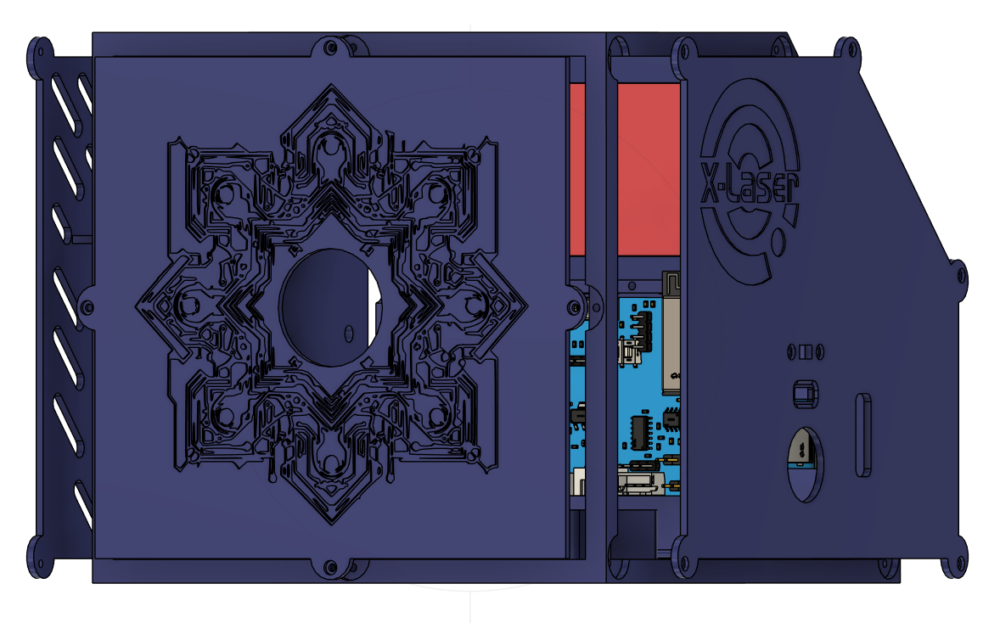
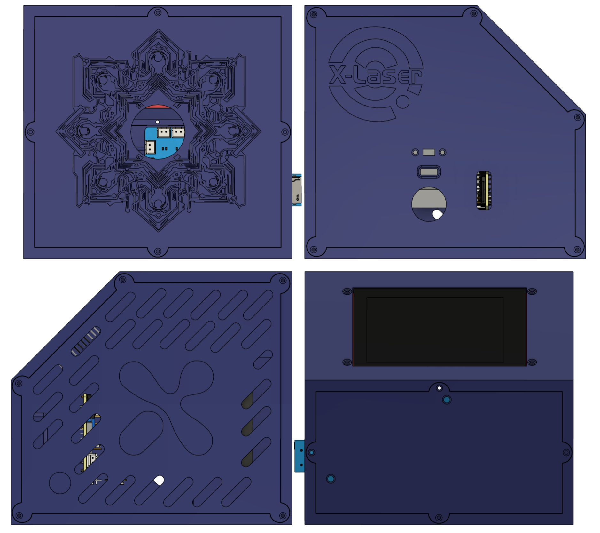
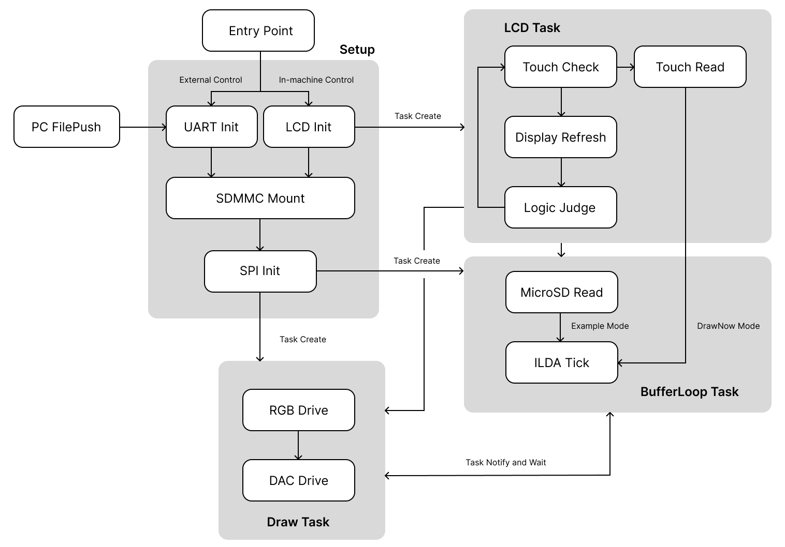
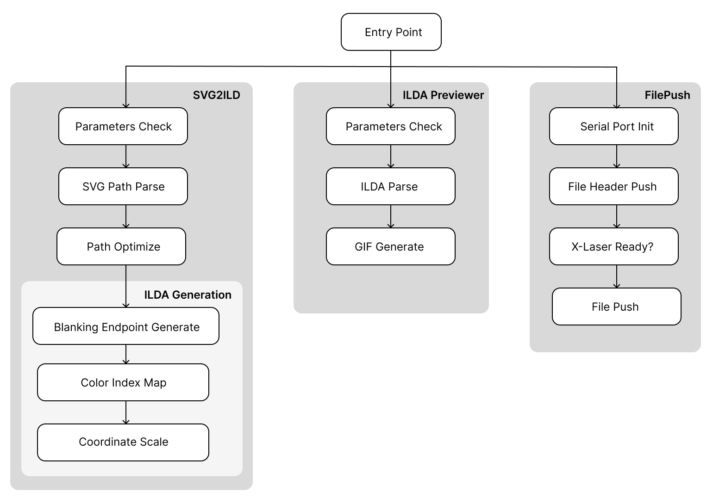
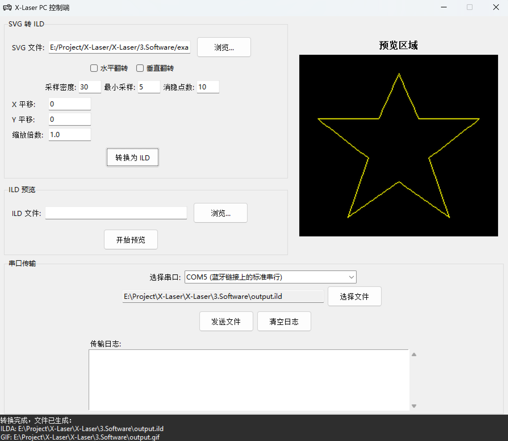

# X-Laser 矢量激光投影仪

> 
> X-Laser是我们做的一款小型的矢量激光投影仪，旨在为用户带来全新的激光体验——轻松创建个性化投影，应用于各类场景中。X-Laser以激光搭建虚拟与现实的桥梁，为影像呈现、艺术创造、行车导航等应用提供创意新思路。

本项目基于激光振镜技术，通过振镜的偏移改变激光发射方向，利用人眼视觉暂留效应投影矢量动画。用户可以将激光动画（以ild为后缀的文件）存储到MicroSD卡中，启动后选择“Example”进行播放；也可选择“Draw Now”，在LCD屏幕上绘制自己想要的激光动画进行投影！

本仓库开源的资料包括

- 两块核心板的电路设计原理图和PCB
- MCU固件源码及屏幕UI工程源文件
- 上位机软件源码
- 外壳设计结构工程源文件

github仓库链接 [https://github.com/zrrraa/X-Laser](https://github.com/zrrraa/X-Laser)

嘉立创工程链接 [https://oshwhub.com/small-horn-projection-team/x-laser](https://oshwhub.com/small-horn-projection-team/x-laser)

B站演示视频 

[【X-Laser】矢量激光投影仪！磕磕绊绊四个月终于收工！_哔哩哔哩_bilibili](https://www.bilibili.com/video/BV12m411z7Wr/?spm_id_from=333.1387.favlist.content.click&vd_source=1d0c07486a3bd3b0adb8ac548bf6453e)

[【X-Laser V2】我们对一年前做的激光投影仪进行了全面更新……_哔哩哔哩_bilibili](https://www.bilibili.com/video/BV1VbKRzCEdx/?spm_id_from=333.1387.homepage.video_card.click&vd_source=1d0c07486a3bd3b0adb8ac548bf6453e)


# 0. 更新日志

2024.04.09

* 第一版开源

2025.06.20

* 优化了Draw Now模式下激光“拖尾”的问题，现在离散地线条均可清晰地分开
* 新增上位机控制，可在PC端实时调试投影。上位机支持SVG转ILDA，ILDA预览功能！

# 1. 项目说明

## 1.1 项目文件架构

### 1.1.1 Hardware

文件夹内是X-Laser的核心电路板原理图和PCB，提供的是立创EDA专业版格式的源文件以及Garber格式的光绘文件。



一共两块板子：

- 主控板(Master Control)：X-Laser的核心控制板PCB，主控为esp32，外围电路集成了DAC，MicroSD，TFTLCD的驱动，其中TFTLCD通过杜邦线和主控板相连。振镜电机驱动板和激光驱动板通过XH线与主控板相连。
- 电源板(Power Supply)：用于处理+12V，+18V，+15V，-15V的电平关系转换。电源板和主控板通过排针排母和铜柱连接固定，排针排母为主控板提供+15V和-15V，作为差分电路的运放电源。

### 1.1.2 Firmware

Firmware中提供了主控板的固件源码，build文件夹包含预编译好的固件可以直接烧录。源码主要内容如下：

- ESP-IDF FreeRTOS下的多任务循环，包含了三个任务：从SD卡到RAM的读取与缓存，SPI驱动DAC将RAM中的数据输出，TFTLCD的UI交互与控制。主要包含在esp32/src/CoreLoop.cpp文件中。
- TFTLCD的UI文件和SquareLine Studio工程源文件，在LVGL和TFT_eSPI库上实现了用户对激光动画的选择播放和手绘。SquareLine Studio工程在UI文件夹中，lvgl事件和TFTLCD驱动在esp32/lib中和esp32/src/MyTFTLCD.cpp文件中。
- SDMMC的驱动和HSPI、VSPI的驱动，主要包含在esp32/src/SPIRenderer.cpp和esp32/src/SDCard.cpp中。
- ILDA文件相关的函数，主要包含在esp32/src/ILDAFile.cpp中。
  代码是在vscode的platformio下架构的，用platformio打开工程，通过CH340连接TX、RX引脚即可烧录固件。

### 1.1.3 Software

Software中提供了上位机控制软件的源码，以及编译好的上位机exe文件。源码主要内容如下：

* filepush文件夹中包括了串口发送文件实时投影相关的函数。
* ilda文件夹中包括了svg转ild格式文件、ild文件预览相关的函数。
* all_in_one_v3.py集成了所有相关的功能函数，配置好环境后可独立运行，是上位机软件的源码。

### 1.1.4 3D Model

文件夹里是X-Laser结构设计的fusion源工程文件和可直接用于3D打印的模型文件。

### 1.1.5 Docs

包含了相关的参考文档，包括ILDA文件的文档、可播放的激光动画文件、重要芯片的Datasheet，以及本项目用到的外设的相关参数和物料清单等。

# 2. 硬件架构说明

## 关于结构设计

X-Laser的结构设计包括一个只含上下底的框架和四片面板，通过螺栓螺母和螺丝固定。



其中侧面包含了固定激光振镜驱动板的结构，主体框架上包括了固定振镜电机和RGB激光模组的结构。



Logo面包含了电源总开关的固定螺纹、SD卡的镂空槽、拨动开关的安装槽以及串口模块的镂空槽，固定激光振镜驱动板的一面采用连续开槽设计，美化观感以及方便散热。主体框架的斜面上设计了固定TFTLCD屏幕的光孔。两块PCB通过铜柱和排针排母上下固定，竖直安装在背面。若有装配支架的需求，可以购买带磁吸环的支架置于底部。

## 关于固件源码

本项目的固件基于esp-arduino开发，调用了ESP-IDF FreeRTOS的API，很好地同步了多个外设的运作。程序主要流程见下图。



X-Laser选用esp32作为主控MCU，通过HSPI驱动DAC芯片控制振镜电机；RGB激光二极管模组由MCU控制信号决定七种颜色；人机交互接口选用了TFTLCD触摸屏，通过VSPI驱动；MicroSD卡采用SDMMC进行通信。

对于多外设的管理问题，三个外设（将LCD的display和touch视为一个）都需要持续运行，在初版设计中，采用两路SPI控制所有外设，效果不好，SPI分时复用时空闲的任务易跑飞，RTOS的阻塞和通知也无法完美地稳定它们，且投影的帧率会受限，最终选择用SDMMC读取MicroSD卡。

关于缓存和投影两个任务之间的通知和阻塞，思路是所有上层逻辑只控制缓存，不直接对投影生效；缓存满了即自阻塞；投影执行后通知缓存，投影依赖于缓存，不能让投影空帧的情况发生。

在需要清空RAM中激光动画数据时，比如DrawNow模式的Clear，思路类似栈操作，只将指针调回内存起始点，诸如总帧数之类的变量清零，不主动清空动画数据。

LCD的UI基于SquareLine Studio设计。


SquareLine导出的LVGL库里不能调用自己写的函数，为了使用lv_events.c里的按键回调，目前采用的办法是在此文件中的定义一个变量作为按键状态，在自己写的头文件中声明此变量为外部变量，再在LCD Task中对这个变量做判断，即可在自己的函数文件中写按键事件。

## 关于电源管理和振镜驱动

X-Laser采用12V锂电池供电，接口为XH封装，注意正负方向。可装配带有DC口充电的锂电池，将充电口用胶水固定在侧面的圆孔中。12V在电源板上升压为18V，再降压成正负15V（若只升压到+15V无法降压为-15V）。12V给激光驱动板供电，同时也通过排针排母连到主控板，在主控板上降压成5V和3.3V给MCU及板上外设供电；正负15V通过排针排母连到主控板，给控制振镜电机驱动板的差分电路供电。

MCU根据投影点的位置计算比例映射关系，通过DAC输出+1.024V\~+3.072V，经偏置放大电路后转为-2.048V\~+2.048V，输入到振镜驱动板，驱动振镜的偏转。

## 关于大电流驱动问题

对于手绘模式，LCD会读取触摸点和此时的Colorwheel参数，存入结构体变量中，并通知Draw Task循环已存入的触摸点投影。当已存入的点数很少时，振镜电流会很大，导致12V升18V电路中电感焊锡熔化炸飞。在最终版的电路中采用了330uH的大电感，并且在固件源码中对点数做了判断，在点数少时降低了振镜频率。

类似的，电流过大会导致主控板上的自锁开关烧毁。由于这个自锁开关仅在测试时用到，后续焊接时换成了排针和跳线帽常闭连接，PCB和原理图上没作修改。

在最初版的电路中，我们尝试直接用mos管驱动激光二极管，导致激光二极管工作在不正常的状态，烧坏了很多个；同时mos管因承受不了大电流也频繁烧坏，后改为采用原配激光驱动板进行驱动，mos管仅作开关电路。

## 关于编译，烧录和启动

芯片至少需要有2MB的Flash，在platformio中编译时需要加入分区表，可参考官方分区表example。本项目的分区表在Firmware/esp32/huge_app.csv中。MicroSD的DAT0引脚连到了esp32的IO2，会强制拉高，在烧写固件时需要给H31排针插上跳线帽，将此引脚拉低，让esp32进入下载模式。在X-Laser中我们选用了N8R8的模组芯片，实际上不需要这么多RAM，因为采用了动态读写。

esp32的上电自启动需要BOOT拉高，虽然BOOT默认上拉，但在最后一版设计中实际测试时发现如果没有手动上拉程序不会自启动，因此在最后一版电路中用1K的电阻手动上拉。
在MicroSD卡中新建一个文件夹命名为ILDA，放入激光动画文件，启动后可在屏幕的roller中看到读取到的激光动画文件。动画文件名称长度要短于15个，否则会显示不全，也无法正常播放。

## 关于DrawNow模式

触摸屏的刷新和读取触摸点有频率限制，因此“缓慢”地绘制效果更好。绘制激光动画时，激光二极管需要在两条连续的曲线之间关闭，等待振镜偏移后再开启，否则会让整个图案封闭。在ILDA文件中已考虑到这些地方并做了路径规划。在DrawNow模式下，关断激光二极管等待振镜偏移后再开启仍有视觉暂留的效果，加入少量延时有改善，测试中5ms最佳，延时多了会导致动画频闪。

```
……
else
{
    digitalWrite(PIN_NUM_LASER_R, HIGH);
    digitalWrite(PIN_NUM_LASER_G, HIGH);
    digitalWrite(PIN_NUM_LASER_B, HIGH);
    delay(5); // 保证曲线断开
}

// DAC输出刷新
digitalWrite(PIN_NUM_LDAC, LOW);
digitalWrite(PIN_NUM_LDAC, HIGH);
```

**更新了解决方案：不用延时，改为增加消隐点，见第三章软件架构中关于源码小节对消隐点的说明。**

## 关于PC FilePush

用户可通过拨动侧面的开关来选择上电后的控制模式，分为PC控制和触摸屏控制。拨动开关控制引脚为IO35，可在第一版的基础上通过飞线连接。PC控制下，上位机与X-Laser之间通过串口通信。我们在侧面板上加装了TTL转TypeC母口的模块，可通过USB转TypeC数据线连接X-Laser与PC端上位机。

本质上播放SD卡中的ILDA文件，只不过通过上位机实时将文件从PC发送到X-Laser的SD卡内了。需要在SD卡的根目录下新建文件夹“FilePush”，用于储存上位机发送的文件。

# 3. 软件架构说明

## 关于环境配置

使用python自带的venv创建虚拟环境。

```bash
python -m venv xlaser # 创建虚拟环境
.\xlaser\Scripts\activate # 激活虚拟环境，linux下可能要用bash .\xlaser\Scripts\activate
pip install -r .\requirements.txt # 安装依赖项
python all_in_one_v3.py # 运行上位机
```

## 关于编译

使用pyinstaller编译代码为可执行文件。

```bash
pyinstaller -F -w --add-data "icon.ico;." .\all_in_one_v3.py
```

我们也提供了打包好的all_in_one_v3.exe文件。

## 关于源码

上位机基于Python开发，支持SVG转ILDA，ILDA预览以及串口发送的功能。程序主要流程见下图。



上位机的图形化界面如下图。



ILDA格式太古老了，网上几乎找不到相关的修改以及查看的软件，于是我们根据5.Docs/ILDA中的说明手册写了个预览功能，目的是把ILDA格式的激光动画转为GIF格式的动画。为了加快处理速度，将预览的GIF分辨率降至200*200，帧率为30帧每秒。

在调试过程中，我们将JSON文件作为ILDA格式转换的中间变量，方便阅读。如有需要了解激光动画具体的坐标数据、颜色数据，可自行研究ilda文件夹中与JSON有关的py代码，包括SVG转JSON，ILDA转JSON，JSON转GIF，JSON转ILDA等。

为了更方便大家定制投影图案，我们开发了SVG转ILDA的功能。目前仅支持包含PATH元素的SVG文件，但网上已有很多方法把各种图形转为仅包含PATH元素的SVG矢量图了。只需对每个元素进行采样，将采样点的坐标和颜色按照ILDA的格式写入即可。为了减少振镜偏转的无效路径，我们对采样点进行了简单的路径规划，在每一个元素的末尾寻找下一个相邻最近元素。注意到激光的“拖尾”问题，我们在每个元素的末尾添加了消隐点，即空白占位点，振镜会在此位置停留，等待激光二极管正确关闭，再移至下一个要投影的点位。消隐点避免了振镜已经偏转但是激光二极管仍未正确关断造成的“拖尾”现象。

SVG的采样参数在大多数情况下都可以按照默认值，但对于某些离散元素过多、图案复杂的情况，或希望深入调试最好投影效果的开发者来说，我们也给予了修改参数的选项，可修改采样密度、最小采样以及消隐点数三个参数。举例，将最小采样和消隐点数从5/10改为2/5可以减少总投影点数，减少复杂图形的频闪现象。

# 4. 致谢

youtube博主atomic14的项目为我们学习ILDA文件的结构解析以及整体代码架构带来了很大的帮助。
[https://github.com/atomic14/esp32-laser-show/tree/main](https://github.com/atomic14/esp32-laser-show/tree/main)

up主酷睿比比的项目bbLaser中优秀的结构设计和代码思路为X-Laser的设计提供了很大的帮助，非常感谢。
[https://github.com/RealCorebb/bbLaser](https://github.com/RealCorebb/bbLaser)

kvdz的正负电源文章写得非常详细，在我们设计电源板中的正负电源电路时提供了很大的帮助。
[https://blog.csdn.net/kvdz_taobao_com/article/details/103510539](https://blog.csdn.net/kvdz_taobao_com/article/details/103510539)

Pieski在电路调试上给予了我们很多指导意见，特此致谢。

稚晖君老师的项目开源架构非常完善，具有参考价值，为我们第一次尝试开源提供了很好的学习途径。
[https://github.com/peng-zhihui/HelloWord-Keyboard/tree/main](https://github.com/peng-zhihui/HelloWord-Keyboard/tree/main)

感谢浙江大学启真交叉学科创新创业实验室提供的项目开发资金，感谢浙江大学集成电路学院IDEA实验室提供的算力支持。
